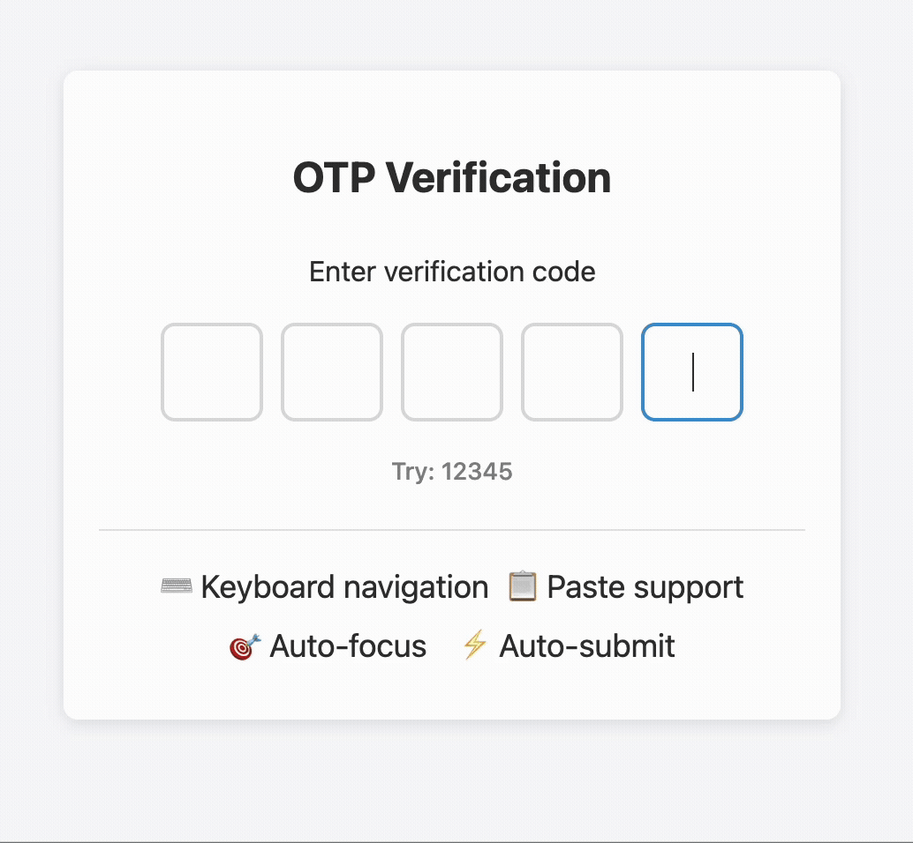

# 🧩 OTP Component - React

A comprehensive, reusable React component for OTP (One-Time Password) input fields, designed with interview best practices and real-world usability in mind.

**GitHub Repository**: [https://github.com/sudo-sanjeev/otp](https://github.com/sudo-sanjeev/otp)

## ✅ Milestones

| Milestone | Description                                                                                                                                         |
| --------- | --------------------------------------------------------------------------------------------------------------------------------------------------- |
| 1         | **Core Functionality**: Configurable length (4-6 digits), numeric-only input, single character per field, auto-focus navigation, backspace handling |
| 2         | **Enhanced UX**: Paste support with auto-distribution, arrow key navigation, click-to-focus, auto-submit when complete                              |
| 3         | **Validation & Accessibility**: Error handling, customizable styling, ARIA labels, keyboard navigation, screen reader support                       |

## 🎬 Demo



## 🚀 Quick Start

```jsx
import Otp from "./component/Otp";

function App() {
  const handleOtpComplete = (otp) => {
    console.log("OTP entered:", otp);
    // Handle OTP verification
  };

  return (
    <Otp otpLength={5} autoSubmitDelay={500} onComplete={handleOtpComplete} />
  );
}
```

## 📋 Props API

| Prop              | Type     | Default    | Description                   |
| ----------------- | -------- | ---------- | ----------------------------- |
| `otpLength`       | number   | 5          | Number of OTP digits          |
| `autoSubmitDelay` | number   | 500        | Delay before auto-submit (ms) |
| `onComplete`      | function | `() => {}` | Callback when OTP is complete |

## 🏗️ Architecture

```
src/
├── component/
│   ├── Otp.js              # Main OTP component
│   ├── styles.css          # Component styling
│   └── hooks/
│       └── useOtp.js       # Custom hook with all logic
```

**Key Design Decisions:**

- **Custom Hook Pattern**: Logic separated into `useOtp` hook for reusability
- **Ref Management**: `useRef` array to manage focus across input fields
- **Event Handling**: Comprehensive keyboard and paste event handling

## 📖 Complete Code Walkthrough

For detailed code explanations, implementation strategies, and step-by-step breakdown of the OTP component, check out the comprehensive guide:

**📚 [React Machine Coding Interview Guide: OTP Component](https://medium.com/@sanjeev-singh/react-machine-coding-interview-guide-otp-component-144ab17d7720)**

This article covers:

- Complete code implementation with explanations
- Step-by-step development approach
- Interview strategies and time management
- Key implementation decisions and best practices
- Edge cases and accessibility considerations

## 🧪 Interview Strategy

### Time Management (30 minutes)

1. **Requirements Gathering** (5 min): Ask clarifying questions
2. **Core Implementation** (15 min): Focus on basic functionality first
3. **Enhancement** (10 min): Add UX improvements if time permits

### Key Questions to Ask

- Should we validate the OTP or is a placeholder fine?
- Is the OTP length fixed or dynamic?
- Should we support paste functionality?
- Any specific UI/UX requirements?

### What Impresses Interviewers

- **Clean, modular code** with proper separation of concerns
- **Accessibility considerations** from the start
- **Edge case handling** (paste, keyboard navigation)
- **Performance considerations** (proper cleanup, ref management)

## 🚀 Running the Project

```bash
npm install
npm start
```

## 📝 Final Notes

In interviews, focus on:

1. **Think before you code** - Show your thought process
2. **Write clean, understandable code** - Quality over quantity
3. **Handle one thing well** - Better to nail core functionality than half-implement everything

Sometimes solving one part exceptionally well impresses more than a rushed, complete solution.

---

_Built with ❤️ for the React community and interview preparation_
